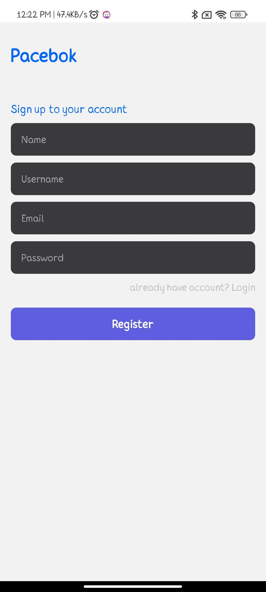
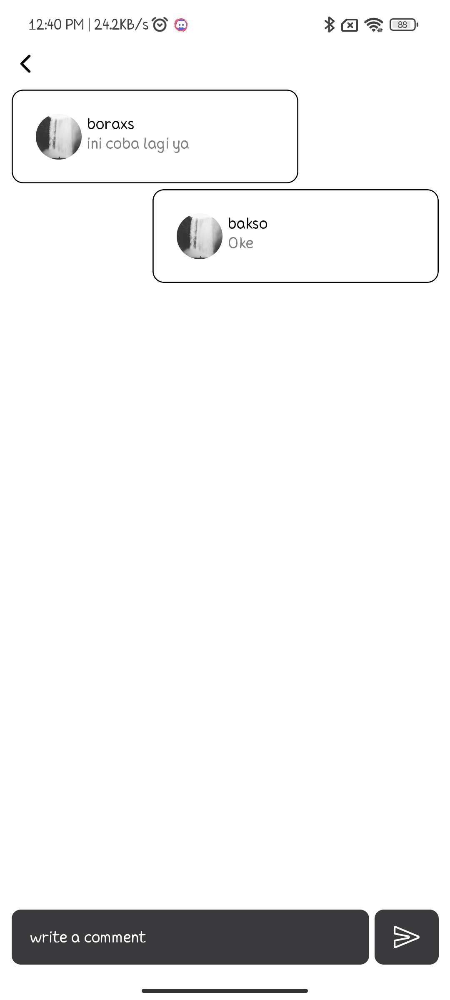
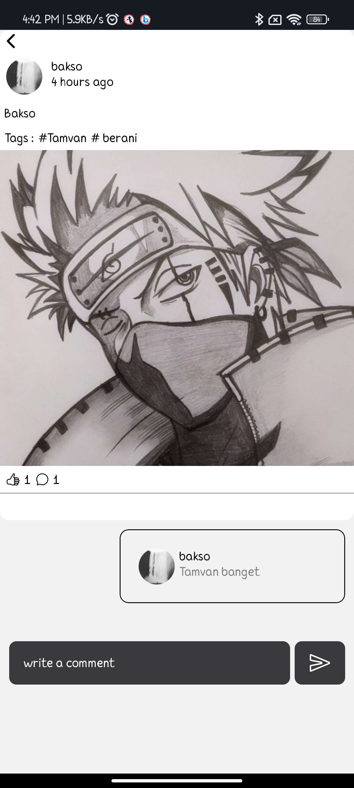
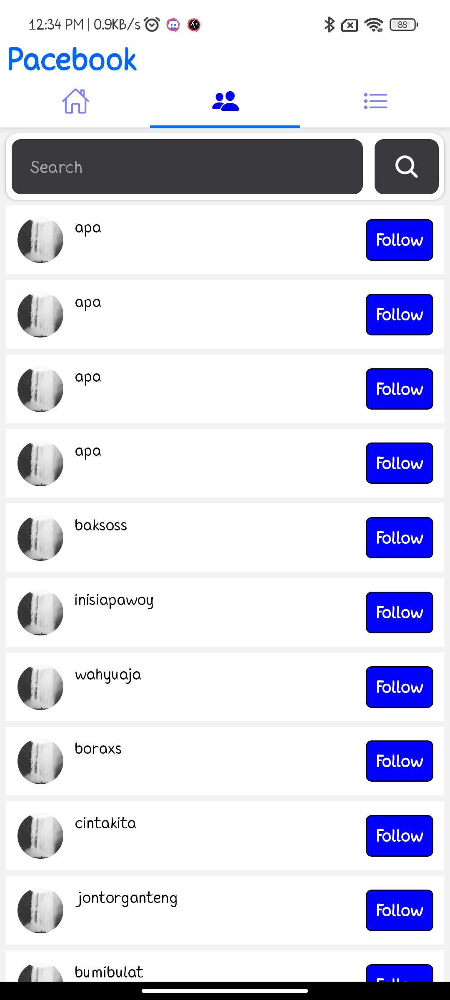
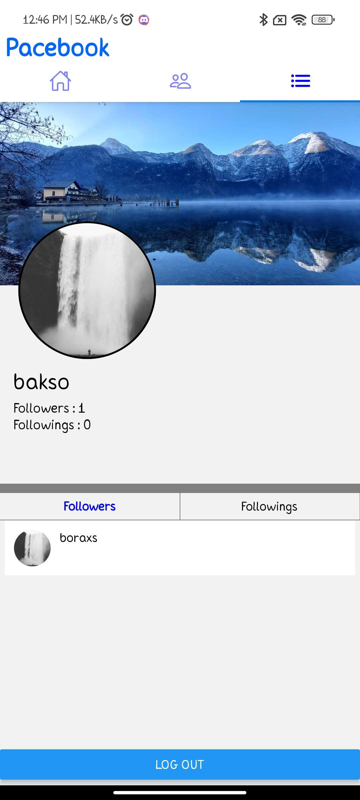

# Pacebook
aplication clone from Facebook using react native and back end using mongodb

##

    

        
Login Page

        
    

    

        
Register Page

        
    

##

    

        
Home Page

        
    

    
    

        
Comment a Post

        
    

    
        

        
After add a new Post

        
    

##

    

        
Add a new Post

        
    

    
    

        
After add a new Post

        
    

##

    

        
Find user

        
    

    
    

        
Search user

        
    

##

User Profile

